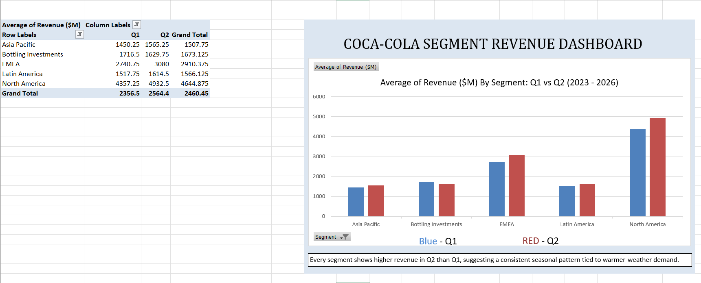

# Coca-Cola Segment Revenue Analysis
**Tools used:** Excel (PivotTables) · Power BI (interactive dashboard)
**Data:** Coca-Cola quarterly segment revenue, Q1 2023 – Q2 2026 (sourced from SEC filings and Coca-Cola's Q2 2026 earnings release)

## The Question
Coca-Cola reports revenue across five operating segments: North America, Europe/Middle East/Africa (EMEA), Latin America, Asia Pacific, and Bottling Investments. I wanted to understand:
- Which segments are the largest and which are growing fastest?
- Is there a seasonal pattern in Coca-Cola's revenue?
- How has overall performance changed from 2023 to 2026?

## Approach
1. **Data preparation:** Compiled 14 quarters of segment-level revenue into a tidy dataset suitable for analysis.
2. **Excel:** Built a PivotTable comparing average Q1 vs. Q2 revenue by segment across all four years, to test for seasonality on a like-for-like basis (rather than comparing full years to partial years).
3. **Power BI:** Built an interactive dashboard with a full 14-quarter trend line by segment, a 2026 year-to-date snapshot comparison, a segment filter, and a headline revenue growth metric.

## Key Findings

**1. North America and EMEA are Coca-Cola's largest and fastest-growing segments.**
Both segments have grown consistently since 2023, while Asia Pacific, Latin America, and Bottling Investments have remained comparatively flat over the same period.

**2. Coca-Cola's revenue is seasonal, and it's consistent across every segment.**
Every single segment showed higher revenue in Q2 (April–June) than Q1 (January–March), across all four years measured. This lines up with the intuitive explanation — warmer weather drives higher beverage demand — but the fact that it holds true across every region and year suggests it's a structural, predictable pattern rather than a one-off.

**3. Overall revenue grew approximately 13% from H1 2023 to H1 2026.**
Comparing the same six-month window (Q1+Q2) year over year avoids skewing the comparison with partial-year data, and shows steady, moderate growth over the three-year period.

## Recommendation
Given the consistency of the Q2 seasonal uplift, Coca-Cola's regional teams could plan inventory, marketing spend, and bottling capacity around this predictable demand curve rather than treating it as unexpected each year. Separately, since Bottling Investments and Asia Pacific have grown more slowly than North America and EMEA, it may be worth investigating whether this reflects strategic deprioritization (e.g. refranchising bottling operations) or a genuine growth opportunity being under-served.

## Notes on the Data
- 2025 and 2026 figures reflect Q1–Q2 only (H1), as full-year data was not yet available at the time of analysis. All comparisons involving these years were adjusted to compare like periods (H1 vs. H1) rather than full years vs. partial years.
- "Corporate" and "Eliminations" reporting lines were excluded from segment comparisons, as they are accounting adjustments rather than operating business segments.
 
